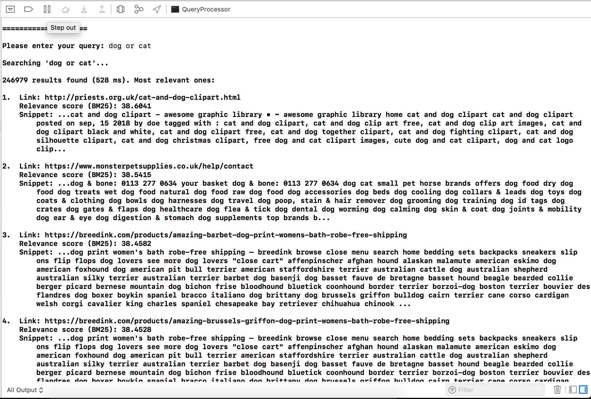

# QueryProcessor

CS 6913 (Web Search Engine) Assignment - NYU Tandon School of Engineering

## Goal
Create a query processor using the inverted index created in [IndexBuilder](https://github.com/hieusydo/IndexBuilder)

## What It Does
- Use Document-At-A-Time processing
- Handle simple conjunctive and disjunctive queries
- Response time under a second

## Screenshots
Sample conjunctive query:

Sample disjunctive query:
